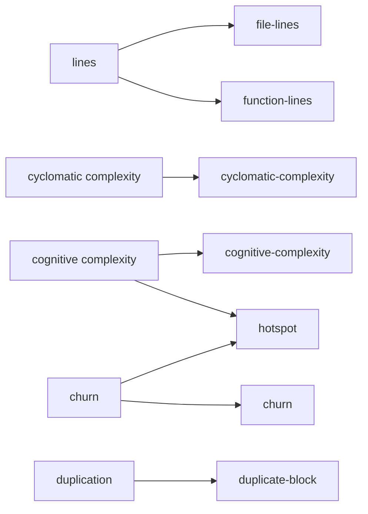
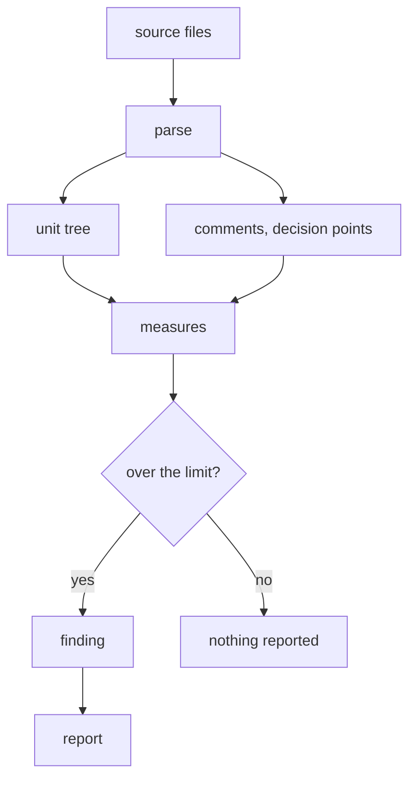

# Concepts

Four words carry most of the meaning in jabuti: unit, measure, rule and finding. Once those are
clear, the output of `jabuti check` reads on its own.

## Unit

A unit is a named piece of code that can be measured on its own. A function is a unit. So is a
module, a type, a closure, and the file itself. Units nest, the way code does.

```rust
mod parser {          // module
    struct Config {}  // type

    impl Config {     // type
        fn new() {}   // function
    }
}
```

Every number jabuti reports belongs to a unit, which is why findings point at a function by name and
not just at a line.

When a unit contains another unit that gets measured separately, the inner one does not inflate the
outer one. A function declared inside another function has its own score. A closure does not, because
a closure is part of the flow of whatever contains it, and reading the outer function means reading
the closure too.

## Measure

A measure is a number, and nothing more. "This function is 71 lines long" is a measure. It does not
claim that 71 is too many.

Keeping measures free of judgement matters more than it sounds, for two reasons. The first is that
you can change a limit without anyone touching how the number is calculated. The second is that a
single measure can feed several different questions.



`hotspot` is where measures earn their keep. Complexity on its own is a weak signal and change
frequency on its own is not a signal at all, but a file that is both is where time goes. Neither
measure had to change for that rule to exist.

## Rule

A rule reads a measure, compares it against a limit, and decides whether you should hear about it. A
rule has an identifier you can put in configuration, a limit, and a severity.

Severity has three settings:

| Severity | What happens |
|---|---|
| `error` | The finding is reported and the command fails |
| `warning` | The finding is reported and the command still passes |
| `off` | The measure is still calculated, but nothing is reported |

`off` is not the same as removing the rule. The number is still there, which is what allows rules
that combine several measures to work later on.

## Finding

A finding is one rule firing on one unit. This is what you see:

```
src/handler.rs:120  error  function-lines  handle_request  measured 71, limit 60
```

Reading left to right: where it is, how seriously to take it, which rule fired, which unit it
belongs to, and the two numbers that made it fire.

There is deliberately no advice in that line. jabuti tells you what it measured. What to do about it
depends on the code, and you can see the code.

## How a run works



The important part of that picture is that measuring and deciding are separate steps. Everything to
the left of the diamond is arithmetic. Everything to the right is policy, and policy is what your
`jabuti.toml` controls.

## Scoping to a change

By default `jabuti check` looks at everything. On a codebase with any history, most of what it finds
is code nobody has touched in months, which is rarely what you want to act on today.

```console
$ jabuti check --since main
```

With `--since`, only files that changed against that reference are analysed, and only findings that
overlap a changed line are reported. Uncommitted edits and brand new files count as changed.

This is also the setting that makes it practical to fail a build on findings. A function that was
already too long stays quiet until someone edits it, so you can turn the gate on today instead of
waiting for a cleanup that never gets scheduled.

## Other shapes of output

`--format agent` is the default and the one built for reading. Two others exist for programs.

`--format json` carries the same findings with a schema version, so a build or a bot can consume
them without parsing text:

```json
{
  "schema": 1,
  "summary": { "files": 42, "units": 378, "errors": 1, "warnings": 0 },
  "findings": [
    {
      "rule": "function-lines",
      "severity": "error",
      "path": "src/handler.rs",
      "span": { "start_line": 120, "end_line": 190 },
      "subject": "handle_request",
      "detail": { "measured": 71, "limit": 60 }
    }
  ]
}
```

A rule is named the same way here as in your configuration, so anything you read out of the report
can be written straight back into `jabuti.toml`.

`--format measures` is different in kind. It reports every number jabuti computed, for every unit,
including rules that are switched off:

```json
{
  "path": "src/handler.rs",
  "line": 120,
  "subject": "handle_request",
  "kind": "function",
  "values": { "cognitive-complexity": 9, "cyclomatic-complexity": 4, "function-lines": 71, "parameters": 2 }
}
```

Nothing is filtered and no thresholds are applied, because the point is to have the raw numbers for
questions we have not thought of. Crossing complexity with change frequency is the combination we
happen to know about; there are others, and finding them needs the numbers rather than the verdicts.

## Exit codes

| Code | Meaning |
|---|---|
| `0` | Nothing to report, or only warnings |
| `1` | At least one `error` finding |
| `2` | jabuti itself failed, for example an unreadable configuration file |

The difference between `1` and `2` matters if something automated is reading the result. `1` means
your code needs attention. `2` means the tool does, and nothing was checked.
