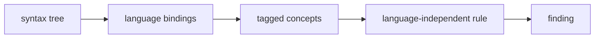
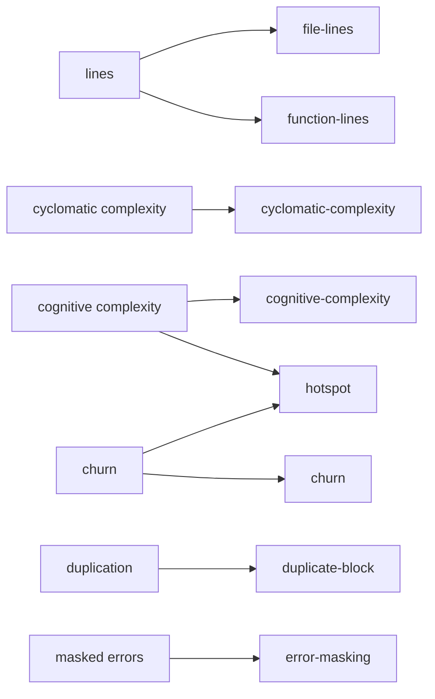
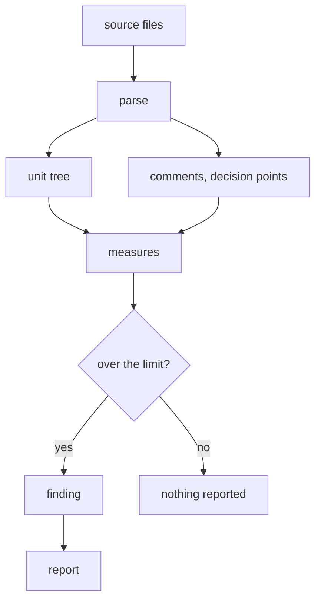

# Concepts

Five words carry most of the meaning in jabuti: concept, unit, measure, rule and finding. Once those
are clear, the output of `jabuti check` reads on its own.

## Concept

A concept is a language-independent fact attached to a piece of syntax. Rust's `.unwrap()`, Kotlin's
`!!` and an empty TypeScript `catch` look unrelated in their syntax trees. Each removes an error path,
so their language tables bind them to the vocabulary consumed by `error-masking`.


```mermaid
flowchart LR
    ast["syntax tree"] --> binding["language bindings"]
    binding --> concept["tagged concepts"]
    concept --> rule["language-independent rule"]
    rule --> finding["finding"]
```

Real projects wrap library APIs. A local binding extends the built-in vocabulary without replacing
it:

```toml
[languages.typescript.concepts]
error-discard = ["@mycorp/errors.discard"]
```

If that symbol is imported under another name, jabuti resolves the import alias before comparing the
path. This is reference resolution, not type inference; a method selected only by the receiver's type
remains outside what a syntax-level check can prove.

## Unit

A unit is a named piece of code that can be measured on its own. A function is a unit. So is a
module, a type, a closure, and the file itself. Units nest, the way code does.

```rust
mod parser {          // module
    struct Config {}  // type

    impl Config {     // type
        fn new() {}   // function
    }
}
```

Every number jabuti reports belongs to a unit, which is why findings point at a function by name and
not just at a line.

When a unit contains another unit that gets measured separately, the inner one does not inflate the
outer one. A function declared inside another function has its own score. A closure does not, because
a closure is part of the flow of whatever contains it, and reading the outer function means reading
the closure too.

## Measure

A measure is a number, and nothing more. "This function is 71 lines long" is a measure. It does not
claim that 71 is too many.

Keeping measures free of judgement matters more than it sounds, for two reasons. The first is that
you can change a limit without anyone touching how the number is calculated. The second is that a
single measure can feed several different questions.


```mermaid
flowchart LR
    lines["lines"] --> fl["file-lines"]
    lines --> fnl["function-lines"]
    cyc["cyclomatic complexity"] --> cc["cyclomatic-complexity"]
    cog["cognitive complexity"] --> cogr["cognitive-complexity"]
    cog --> hs["hotspot"]
    churn["churn"] --> hs
    churn --> chr["churn"]
    dup["duplication"] --> db["duplicate-block"]
    mask["masked errors"] --> em["error-masking"]
```

`hotspot` is where measures earn their keep. Complexity on its own is a weak signal and change
frequency on its own is not a signal at all, but a file that is both is where time goes. Neither
measure had to change for that rule to exist.

## Rule

A rule reads a measure, compares it against a limit, and decides whether you should hear about it. A
rule has an identifier you can put in configuration, a limit, and a severity.

Severity has three settings:

| Severity | What happens |
|---|---|
| `error` | The finding is reported and the command fails |
| `warning` | The finding is reported and the command still passes |
| `off` | The measure is still calculated, but nothing is reported |

`off` is not the same as removing the rule. The number is still there, which is what allows rules
that combine several measures to work later on.

## Finding

A finding is one rule firing on one unit. This is what you see:

```
src/handler.rs:120  error  function-lines  handle_request  measured 71, limit 60
```

Reading left to right: where it is, how seriously to take it, which rule fired, which unit it
belongs to, and the two numbers that made it fire.

There is deliberately no advice in that line. jabuti tells you what it measured. What to do about it
depends on the code, and you can see the code.

## How a run works


```mermaid
flowchart TD
    files["source files"] --> parse["parse"]
    parse --> units["unit tree"]
    parse --> facts["comments, decision points"]
    units --> measures["measures"]
    facts --> measures
    measures --> policy{"over the limit?"}
    policy -->|"yes"| finding["finding"]
    policy -->|"no"| quiet["nothing reported"]
    finding --> report["report"]
```

The important part of that picture is that measuring and deciding are separate steps. Everything to
the left of the diamond is arithmetic. Everything to the right is policy, and policy is what your
`jabuti.toml` controls.

That file is looked for in the working directory and then in every directory above it, and the
directory holding it is the project root. Paths in every report, `exclude` patterns and layer paths
are all relative to that root, so the answer is the same whether the command runs from the root or
from three directories down.

## Scoping to a change

By default `jabuti check` looks at everything. On a codebase with any history, most of what it finds
is code nobody has touched in months, which is rarely what you want to act on today.

```console
$ jabuti check --since main
```

With `--since`, only files that changed against that reference are analysed, and only findings that
overlap a changed line are reported. Uncommitted edits and brand new files count as changed.

This is also the setting that makes it practical to fail a build on findings. A function that was
already too long stays quiet until someone edits it, so you can turn the gate on today instead of
waiting for a cleanup that never gets scheduled.

## What the graph sees

Three rules, `new-dependency`, `layer-violation` and `speculative-api`, are answered from a graph of
which files depend on which and which names each declares. The graph is built the same way for all
three, and its limits are the limits of the rules.

### What counts as a dependency

A file depends on another when it names something that other file declares. That happens in more
ways than an import list suggests, and reading only the imports gets it wrong. In this repository,
for example, no file contains `use crate::git`, yet two of them call `crate::git::run` directly on the
line that uses it. An import-only graph would say nothing depends on `git.rs`, and a boundary
around it would hold nothing.

So the whole path is read, wherever it is written:

| Written as | Example |
|---|---|
| An import | `use crate::config::Settings`, `import org.example.catalog.Book`, `import { Book } from "./Book"` |
| A path spelled out where it is used | `crate::git::run(...)` |
| A path relative to a module in scope | `since::latest()` after `mod since;` |
| A path inside a macro | `format!("{}", crate::git::run(...))` |
| In Kotlin, a bare name from the same package | `Book`, with no import, because Kotlin does not need one |
| A relative TypeScript module | `./Book`, `../catalog/Book.js`, or an extensionless `../catalog/Book` |
Kotlin same-package names are invisible to an import-only graph, which is why the reference query
captures them directly. The measured edge shares live in [`CALIBRATION.md`](../CALIBRATION.md).

### What it cannot see

We read syntax, not types, so a dependency that only exists once types are known is not found:

- a method called on a value, since knowing what `service.save()` refers to means knowing the type
  of `service`
- a call that goes through an interface or a trait, where the implementation is chosen at run time
- anything a macro or an annotation processor generates rather than writes

A Rust file's module is read from its place under the nearest `src` directory, which is the layout
Cargo produces. Code kept elsewhere, under `lib/` say, does not resolve. Across crates in a workspace
a reference is matched by crate name, and the crate is assumed to live in a directory called after
it, so a crate whose directory name differs from the name in its `Cargo.toml` is not found.

TypeScript resolution follows relative module specifiers to `.ts` files and `index.ts`. Package
imports and aliases declared only in `tsconfig.json` remain external because resolving them requires
the project's module-resolution configuration.

Name resolution can also point at the wrong file when two declarations share a name, which adds an
edge to the graph rather than removing one. That is the safer of the two mistakes: a dependency
reported that was not there costs you a moment, and a dependency missed costs you the boundary.

### Holding a boundary

Declare which files form a layer and which layers each may depend on, and every crossing is
reported at the line that made it:

```toml
[layers]
domain = { paths = ["src/domain/**"], depends_on = [] }
infrastructure = { paths = ["src/infrastructure/**"], depends_on = ["domain"] }
```

Files matching no layer are left alone in both directions, so the rule can be switched on for the
one boundary you care about without classifying everything first.
[`docs/rules/layer-violation.md`](rules/layer-violation.md) has the details, including the path
pattern mistake that leaves a layer silently empty and how the rule guards against it.

## Other shapes of output

`--format agent` is the default and the one built for reading. Three others exist for programs.

`--format json` carries the same findings with a schema version, so a build or a bot can consume
them without parsing text:

```json
{
  "schema": 3,
  "summary": { "files": 42, "units": 378, "errors": 1, "warnings": 0, "unreadable": 0 },
  "findings": [
    {
      "rule": "function-lines",
      "severity": "error",
      "path": "src/handler.rs",
      "span": { "start_line": 120, "end_line": 190 },
      "subject": "handle_request",
      "detail": { "measured": 71, "limit": 60 }
    }
  ],
  "unreadable": []
}
```

A rule is named the same way here as in your configuration, so anything you read out of the report
can be written straight back into `jabuti.toml`.

`--format sarif` emits one deterministic run conforming to SARIF 2.1.0 and names the
[official errata schema](https://docs.oasis-open.org/sarif/sarif/v2.1.0/errata01/os/schemas/sarif-schema-2.1.0.json):

```json
{
  "$schema": "https://docs.oasis-open.org/sarif/sarif/v2.1.0/errata01/os/schemas/sarif-schema-2.1.0.json",
  "version": "2.1.0",
  "runs": [
    {
      "tool": {
        "driver": {
          "name": "jabuti",
          "semanticVersion": "0.1.0",
          "informationUri": "https://github.com/morais90/jabuti",
          "rules": [
            { "id": "function-lines" }
          ]
        }
      },
      "invocations": [
        {
          "executionSuccessful": true,
          "toolExecutionNotifications": [
            {
              "level": "warning",
              "message": { "text": "unreadable syntax from line 6" },
              "locations": [
                {
                  "physicalLocation": {
                    "artifactLocation": { "uri": "src/broken.rs" }
                  }
                }
              ]
            }
          ]
        }
      ],
      "results": [
        {
          "ruleId": "function-lines",
          "ruleIndex": 0,
          "level": "error",
          "message": { "text": "handle_request measured 71, limit 60" },
          "locations": [
            {
              "physicalLocation": {
                "artifactLocation": { "uri": "src/handler.rs" },
                "region": { "startLine": 120, "endLine": 190 }
              }
            }
          ]
        }
      ]
    }
  ]
}
```

The driver carries the version of jabuti that produced the report. Its rule descriptors are sorted
by identifier and carry identity only. `ruleIndex` links each result to that stable order without
inventing descriptions or help text, including for rules contributed by external tools.

Every finding becomes exactly one result. Jabuti errors map to SARIF `error`, warnings map to
`warning`, and the message contains the same factual subject and detail as the agent line. Regions
contain a one-based `startLine` and inclusive `endLine`. The model measures whole lines, so it does
not pretend to know columns. Artifact URIs are RFC 3986 percent-encoded paths relative to the project
root. Absolute checkout paths and URI bases never enter the report.

A clean run keeps the run metadata and carries `"results": []`. SARIF always contains every result
and every execution notification; `--limit` truncates only the agent format. `partialFingerprints`
are deliberately absent because the reporting model does not carry source-line content from which
to calculate them. [GitHub's `upload-sarif` action](https://docs.github.com/en/code-security/how-tos/find-and-fix-code-vulnerabilities/integrate-with-existing-tools/upload-sarif-file)
synthesizes them when it can read the source. A direct REST upload without them is accepted, but
[may duplicate alerts across runs](https://docs.github.com/en/code-security/reference/code-scanning/sarif-files/sarif-support#data-for-preventing-duplicated-alerts).

## A file jabuti could not read

A grammar can be older than the language it reads, and a file using syntax it does not know cannot be
parsed. Measuring such a file anyway would be worse than not measuring it, because every number would
be computed over a tree with a hole in it, so jabuti refuses it.

What it must not do is refuse quietly. A caller who sees a clean verdict over code that was never
looked at has been told something false, and that is the most expensive mistake this tool can make.
So every file jabuti could not read is named in the output, in all four formats:

```console
$ jabuti check .
No findings across 41 files and 682 units.

1 file was not measured, so nothing above accounts for it.
src/broken.rs  unreadable syntax from line 6
```

In `json` and `measures` the same files arrive under `unreadable`. The `json` summary repeats the
count, so a consumer reading only that still sees it. In SARIF each file is a warning
`toolExecutionNotification` with an artifact-only location. It is not a result, because an unreadable
file describes the limits of the scan rather than a problem found in the source.

`executionSuccessful` remains true because jabuti completed the scan and the results it produced are
valid. An unreadable file does not change the exit status. GitHub code scanning
[currently ignores tool execution notifications](https://docs.github.com/en/code-security/reference/code-scanning/sarif-files/sarif-support#supported-properties),
so retain the SARIF artifact or use the JSON output when those coverage gaps must remain visible.
[`docs/languages.md`](languages.md) lists the constructs currently behind this.

`--format measures` is different in kind. It reports every number jabuti computed, for every unit,
including the ones whose rules are switched off. Values are keyed by measure rather than by rule, so
a file and a function both report `lines`, which `file-lines` and `function-lines` each compare
against a limit of their own:

```json
{
  "path": "src/handler.rs",
  "line": 120,
  "subject": "handle_request",
  "kind": "function",
  "values": { "cognitive-complexity": 9, "cyclomatic-complexity": 4, "lines": 71, "parameters": 2 }
}
```

Nothing is filtered and no thresholds are applied, because the point is to have the raw numbers for
questions we have not thought of. Crossing complexity with change frequency is the combination we
happen to know about; there are others, and finding them needs the numbers rather than the verdicts.

## Exit codes

| Code | Meaning |
|---|---|
| `0` | Nothing to report, or only warnings |
| `1` | At least one `error` finding |
| `2` | jabuti itself failed, for example an unreadable configuration file |

The difference between `1` and `2` matters if something automated is reading the result. `1` means
your code needs attention. `2` means the tool does, and nothing was checked.
