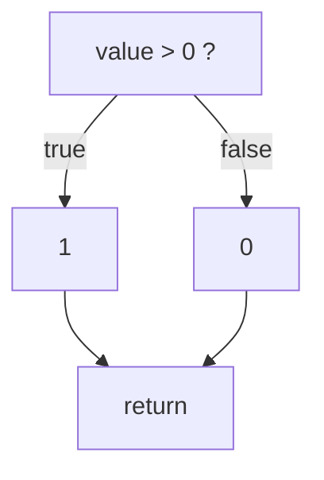

# Cyclomatic complexity

Counts how many different ways execution can flow through a piece of code.

## The idea

Thomas McCabe proposed this in 1976, and it is not a rule of thumb. It comes from graph theory.

Picture a function as a graph. Each node is a run of statements that executes start to finish
without branching, and each edge is a jump the program can take. The complexity is the number of
independent paths through that graph:

```
M = E - N + 2P
```

where `E` is edges, `N` is nodes, and `P` is the number of connected pieces, which is 1 for a single
function.

Take the simplest possible branch:

```rust
fn classify(value: i32) -> i32 {
    if value > 0 { 1 } else { 0 }
}
```



Four nodes, four edges, one piece. `4 - 4 + 2 = 2`.

## Why you can count instead of drawing graphs

Look at what the `if` did to that picture. It added one node and two edges, so `E - N` went up by
exactly one. Every simple branch does the same thing, which gives a shortcut:

```
complexity = number of decision points + 1
```

This is not an approximation. It produces the same number without building the graph, which is why
every tool that reports this metric counts syntax rather than analysing flow.

## What counts as a decision

Anything that makes execution choose. Conditionals, loops, and each alternative in a multi-way
branch.

Logical operators count too, and that surprises people. In most languages `&&` short circuits, so
this code has three paths and not two:

```rust
if a && b { ... }
```

The first is `a` being false, where `b` is never evaluated. The second is `a` true and `b` false.
The third is both true.

**In Rust** the decision points are `if` (including `else if` and `if let`), `while`, `for`, `loop`,
`&&`, `||`, each `match` arm, and each arm guard.

## Two places we do it our own way

**A `match` of N arms adds N-1, not N.** Most implementations add one per arm. Consider these two
pieces of code, which describe the same flow:

```rust
match value {              if value.is_some() {
    Some(x) => x,              x
    None => 0,             } else {
}                              0
                           }
```

The `if`/`else` adds one. Counting every arm would make the `match` add two, so the same logic would
score differently based on how you chose to spell it. Subtracting one for the `match` itself keeps
them equal, and gives the right answer at the edge: a single arm match does not branch at all, and
adds nothing.

**The `?` operator does not count.** It is a branch, so a strict reading would include it. In
practice it appears many times in ordinary Rust, and counting it pushes routine functions past any
threshold without pointing at a decision anyone has to think about.

## What it does not measure

Nesting. These two score exactly the same, at 4:

```rust
if a { }              if a {
if b { }                  if b {
if c { }                      if c { }
                          }
                      }
```

That is not an oversight in the metric. Cyclomatic complexity was designed to answer a testing
question, roughly "how many test cases do I need to cover every branch", and by that measure the two
really are equivalent. It was never meant to say which one is harder to read.

The blindness matters in practice. A large flat `match` that maps strings to values scores high and
reads at a glance:

```rust
fn normalized(method: &Method) -> &'static str {
    match method.as_str() {
        "GET" => "GET",
        "POST" => "POST",
        "PUT" => "PUT",
        // and so on
    }
}
```

That function scores 10. Nothing about it is hard to follow. This is the main reason the
[`cyclomatic-complexity` rule](../rules/cyclomatic-complexity.md) is switched off by default.

## What real code looks like

**Rust**, measured across 737,499 functions in 1,645 crates published on crates.io:

| p50 | p75 | p90 | p95 | p99 |
|---|---|---|---|---|
| 1 | 1 | 2 | 4 | 10 |

Three quarters of all Rust functions score 1, meaning they do not branch at all. Distributions this
skewed are hard to threshold usefully, which the rule page goes into.

Other languages will be measured the same way as they are added.

## Further reading

McCabe, T.J. (1976). *A Complexity Measure*. IEEE Transactions on Software Engineering, SE-2(4). The
original paper, and short enough to read in one sitting.

Shepperd, M. (1988). *A critique of cyclomatic complexity as a software metric*. Software Engineering
Journal. An early and still relevant argument about what the number does and does not tell you.
